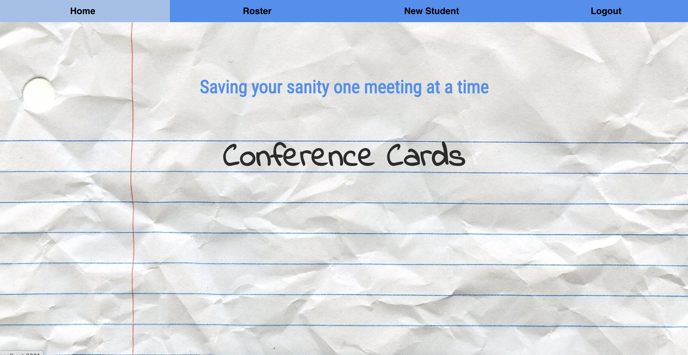
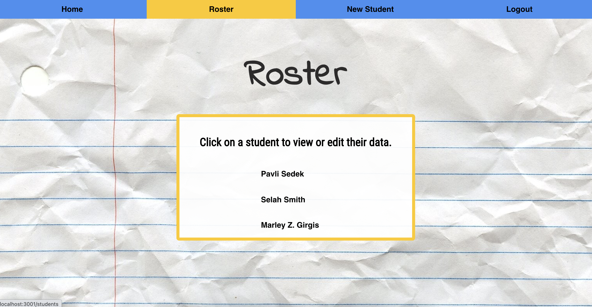
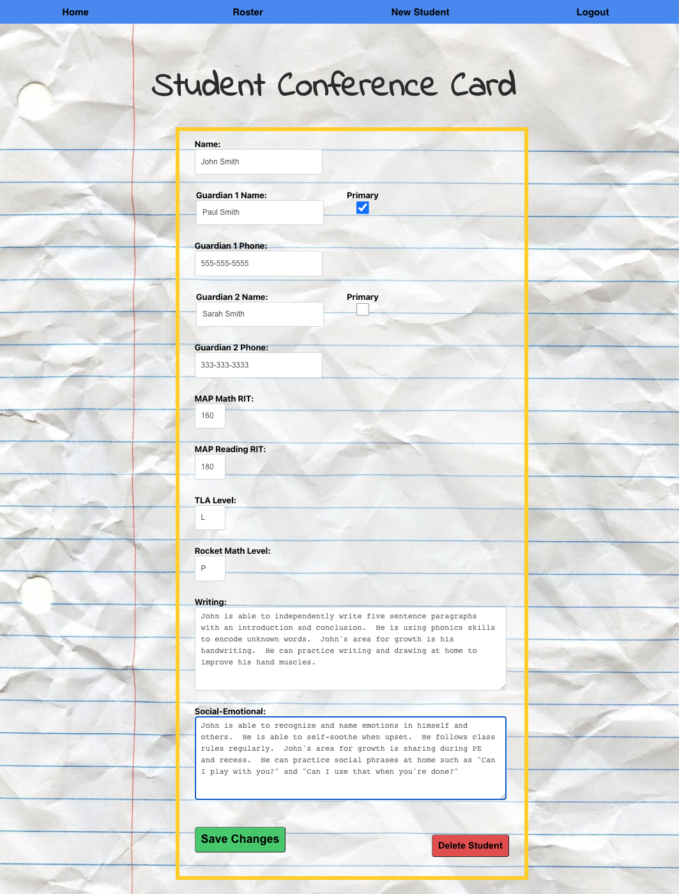
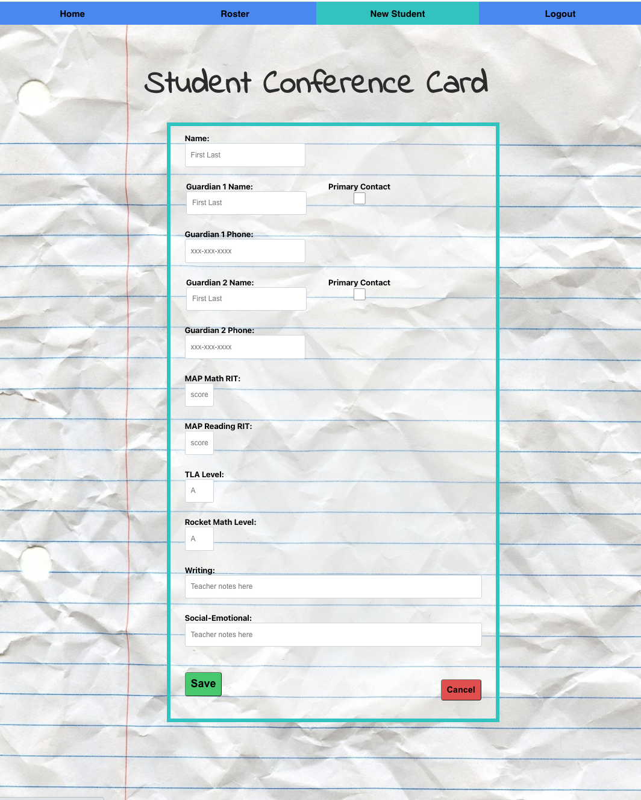
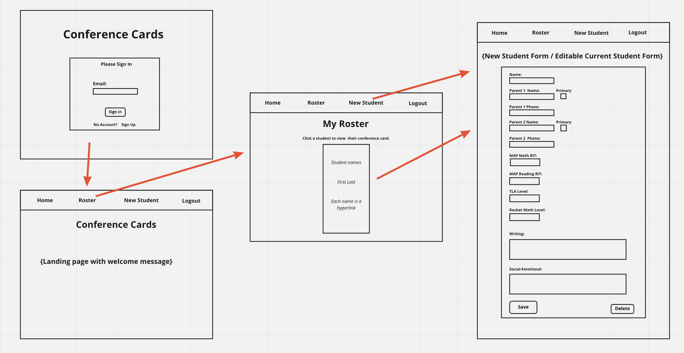
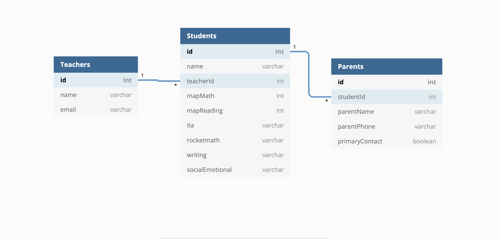

    

# Overview
This CRUD application was inspired by the countless hours teachers spend gathering and organizing student data.  With Conference Cards, teachers can view and manage data for their students in one spot.  Conference Cards has an accessible, easy-to-navigate layout that is intuitive for teachers with limited computer skills and limited time. After logging in, teachers can select a student from their roster in order to vew, edit, or delete their data card.  Teachers can also create cards for new students.

# Features
<ul>
    <li>User authentication</li>
    <li>New user registration</li>
    <li>easy to navigate design</li>
    <li>Ability to create, read, update, and delete student cards</li>
</ul>

# User Stories
<ul>
    <li>As a user, I should be able to log in and view my current roster.</li>
    <li>As a user, I should be able to select a student from the roster and view their card.</li>
    <li>As a user, I should be able to update a student's card as their data changes.</li>
    <li>As a user, I should be able to create a card for a new student.</li>
    <li>As a user, I should be able to delete a card for a student that is no longer enrolled.</li>
</ul>

# Images from Conference Cards

### Homepage

    

### Roster Menu

    

### View or Edit Current Student Card

    

### Create New Student Card

    

# Watch Conference Cards in Action
https://www.loom.com/share/6d03dddb31a649959c1a3174d9770de1

# Wireframe

    

# ERD

    

# Technologies Used
HTML5 / CSS / JavaScript / React / Reactstrap / Git

